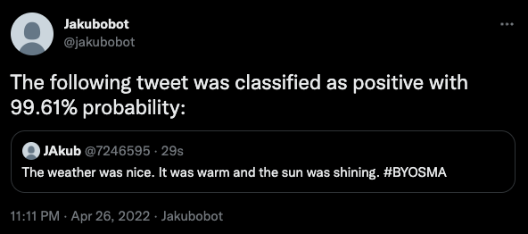

# Build your own social media analytics with Apache Kafka

This repository contains the demo files and applications for my conference talk **Build your own social media analytics with Apache Kafka** at the **[Data on Kubernetes Day @ KubeCon EU 2022](https://dok.community/dok-day-europe-2022-kubecon/)**. The slides are avaiable at [Google Docs](https://docs.google.com/presentation/d/1TVVhEHwGqSlRULrLTJBKJt3BwyBsbdXbV04JpkF1ugo/edit?usp=sharing).

## Prerequisites

1) Install the Strimzi operator.
   The demo is currently using Strimzi 0.28.0, but it should work also with newer versions.
   If needed, follow the documentation at [https://strimzi.io](https://strimzi.io).

2) Create a Kubernetes Secret with credentials for your container registry.
   It should follow the usual Kubernetes format:
   ```yaml
   apiVersion: v1
   kind: Secret
   metadata:
     name: docker-credentials
   type: kubernetes.io/dockerconfigjson
   data:
     .dockerconfigjson: Cg==
   ```

3) Register for the Twitter API and create a Kubernetes Secret with the Twitter credentials in the following format:
   ```yaml
   apiVersion: v1
   kind: Secret
   metadata:
     name: twitter-credentials
   type: Opaque
   data:
     consumerKey: Cg==
     consumerSecret: Cg==
     accessToken: Cg==
     accessTokenSecret: Cg==
   ```

4) Deploy the Kafka cluster:
   ```
   kubectl apply -f 01-kafka.yaml
   ```

5) Once Kafka cluster is ready, deploy the Kafka Connect cluster which will also download the Camel Kafka Connectors for Twitter
   ```
   kubectl apply -f 02-connect.yaml
   ```
   The Kafka Connect deployment needs a registry where to push the newly build container image with the additional connectors.
   You will need to update it to point to your own container registry.

## Doing a sentiment analysis of a search result

1) Deploy the Camel Twitter Search connector
   ```
   kubectl apply -f 10-search.yaml
   ```
   That should create a topic `twitter-inbox` and create the Kafka Connect connector which will search Twitter for the term `#BYOSMA` and send any tweets it fins into this topic.
   You can change the search term in the connector configuration (YAML file)

2) Deploy the Camel Twitter Timeline connector
   ```
   kubectl apply -f 11-alerts.yaml
   ```
   That should create a topic `twitter-outbox` and consume it.
   When a message is sent to this topic, it will be sent as a quote retweet by the Twitter account which was used to connect to the API.

3) Deploy the Sentiment Analysis applications:
   ```
   kubectl apply -f 12-sentiment-analysis.yaml
   ```
   It will read the tweets found by the search connector and do a sentiment analysis of them.
   If they are positive or negative on more than 60%, it will forward them to the outbox topic.
   The timeline connector will pick them up from this topic and send them as tweets on your Twitter timeline.
   

----

_Note: You can also alternatively send the messages as direct messages instead of tweeting them to your timeline._
_To do so, edit the Connect deployment in the `02-connect.yaml` file to enable the Camel Twitter Direct Messages connector._
_And use the following YAML file to create the connector:_
```yaml
apiVersion: kafka.strimzi.io/v1beta2
kind: KafkaConnector
metadata:
name: twitter-alerts
labels:
   strimzi.io/cluster: my-connect
spec:
class: CamelTwitterdirectmessageSinkConnector
tasksMax: 1
config:
   topics: twitter-outbox
   # User to send the alert DM to => replace with your Twitter handle
   camel.sink.path.user: "<YourTwitterHandle>"
   # Twitter account
   camel.sink.endpoint.consumerKey: ${env:TWITTER_CONSUMER_KEY}
   camel.sink.endpoint.consumerSecret: ${env:TWITTER_CONSUMER_SECRET}
   camel.sink.endpoint.accessToken: ${env:TWITTER_ACCESS_TOKEN}
   camel.sink.endpoint.accessTokenSecret: ${env:TWITTER_ACCESS_TOKEN_SECRET}
   # Converting
   key.converter: org.apache.kafka.connect.storage.StringConverter
   value.converter: org.apache.kafka.connect.storage.StringConverter
   key.converter.schemas.enable: false
   value.converter.schemas.enable: false
```

## Useful commands

These commands might be useful when playing with the demo:

### Reseting the streams applications:

_You can run these against the unsecured listener on port 9095._

1) Stop the application

2) Reset the application context
   ```
   bin/kafka-streams-application-reset.sh --bootstrap-servers <brokerAddress> --application-id <applicationId> --execute
   ```

3) Reset the offset
   ```
   bin/kafka-consumer-groups.sh --bootstrap-server <brokerAddress> --group <applicationId> --topic <sourceTopic> --to-earliest --reset-offsets --execute
   ```

### Debugging the messages

1) Read the inbox topic:
   ```
   bin/kafka-console-consumer.sh --bootstrap-server localhost:9095 --from-beginning --topic twitter-inbox
   ```

2) Read the outbox topic:
   ```
   bin/kafka-console-consumer.sh --bootstrap-server localhost:9095 --from-beginning --topic twitter-outbox
   ```